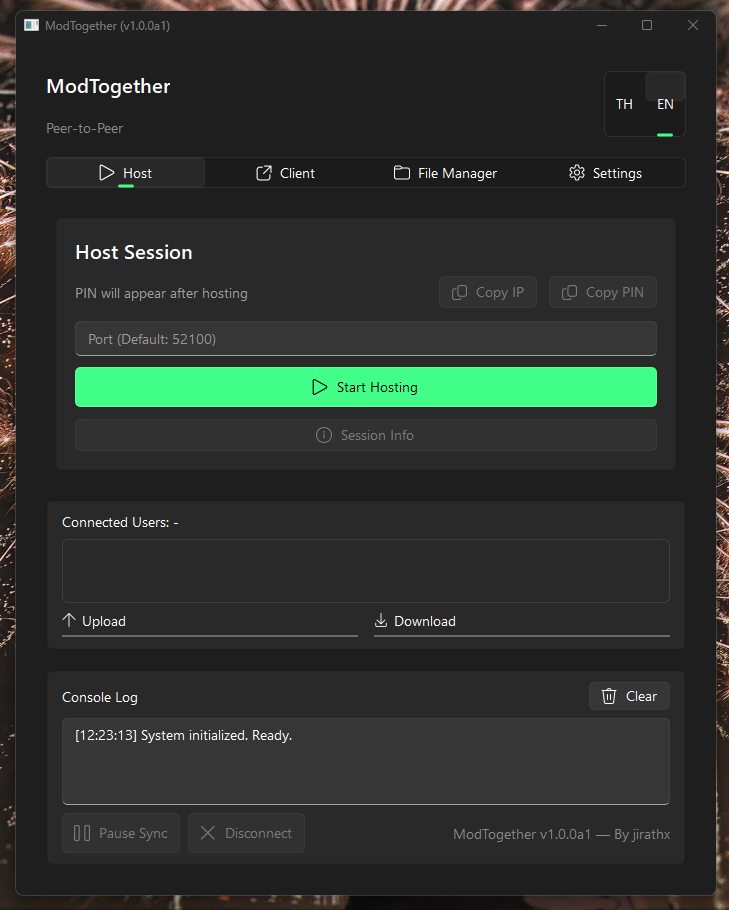

  <h1>ModTogether 🎮</h1>
  
<strong>A fast, secure, and native Peer-to-Peer (P2P) mod synchronization & management tool for PC games.</strong>

  
โปรแกรมสำหรับการซิงค์และจัดการไฟล์ม็อด (Mod) ระหว่างเพื่อนแบบ P2P ที่รวดเร็วและปลอดภัย (C# .NET 8 WPF)

   
  <a href="#-english-version">🇺🇸 English Version</a> &nbsp;|&nbsp; <a href="#-ภาษาไทย-thai-version">🇹🇭 ภาษาไทย (Thai Version)</a>
    
  

---

## 🇺🇸 English Version

> [!WARNING]
> ## Disclaimer
> This application is **NOT** a cheat, hack, or memory injection tool. It is strictly a "File Synchronization & Mod Management Tool" designed to copy mod files over a network between peers. Its sole purpose is to facilitate Co-op gaming by ensuring all players have identical mod files. It does not interact with game memory or bypass Anti-Cheat systems. The mechanism is functionally identical to sending files via Google Drive or Zip archives over chat, but fully automated and direct.

### 📦 Project Editions & Roadmap

- 🐉 **Monster Hunter World Special Edition (`ModTogetherMHW`)** — **[✅ RELEASED / ACTIVE]**
  - Specialized C# .NET 8 WPF build tailored for Monster Hunter World. Combines P2P syncing with native `nativePC` folder management, archive extraction, and file conflict detection.
- ⚙️ **Standard Universal Edition (Generic PC Games)** — **[🛠️ UNDER REFACTORING / COMING SOON]**
  - General-purpose folder-based P2P sync tool for any PC co-op games. Currently being upgraded from legacy Python to native C# .NET 8 WPF.

### 🌟 Features (MHW Special Edition)
- ⚡ **Real-Time P2P Sync:** Any mod added on the Host gets instantly pushed to all connected clients.
- 🏠 **Unified Room Page:** Host (Create Session) and Client (Join Session) combined into a sleek side-by-side layout.
- 📊 **Live Progress Bars:** Track Upload, Download, and Mod Installation progress in real time.
- 📦 **Full Archive Support:** Native handling for `.zip`, `.7z` (including Solid LZMA2 archives), and `.rar`.
- 🗑️ **Smart Recycle Bin:** Deleted files are safely moved to `.recycle_mods` across all peers for instant offline recovery.
- 📁 **Conflict Detection:** Scans mod files to detect potential conflicts with existing `nativePC` files before installation.
- 🌐 **Bilingual UI:** Switch between English and Thai seamlessly on the fly.
- 🛡️ **Network Crash Protection:** Built-in WSAEACCES socket handling and active LAN subnet discovery.
- 🎨 **Windows 11 Native Aesthetics:** Built with C# .NET 8 WPF and `WPF-UI` (WinUI 3 design language).

### 🚀 Build Editions
To accommodate different user needs, ModTogether provides **2 build editions**:
1. 🟢 **Standalone Edition (`ModTogetherMHW_Standalone_x64.exe` ~85MB)**
   - Includes .NET 8 Runtime bundled inside.
   - **No installation or .NET download required.** Runs out of the box on any Windows 10/11 PC.
2. ⚡ **Lightweight Edition (`ModTogetherMHW_Lightweight_x64.exe` ~10MB)**
   - Ultra lightweight (~10MB).
   - Requires [.NET 8 Desktop Runtime](https://dotnet.microsoft.com/download/dotnet/8.0) installed on Windows.

### 🛠️ How to Build
Requires [.NET 8 SDK](https://dotnet.microsoft.com/download/dotnet/8.0) installed.
1. Double-click `build_mhw.bat` (or run `.\build_mhw.bat` in Terminal).
2. The script compiles both editions into the `dist` folder:
   - `dist\ModTogetherMHW_Standalone_x64.exe`
   - `dist\ModTogetherMHW_Lightweight_x64.exe`

### 🎯 How to Use

#### Creating or Joining a Room
1. Open the app and navigate to the **Room** tab.
2. **To Host:** Click **Start Hosting** under *Create Session (Host)*. Share the generated IP and 6-digit PIN with your friends.
3. **To Join:** Enter the Host's IP address and 6-digit PIN under *Join Session (Client)*, or click **Scan LAN** to auto-detect hosts on your local network / VPN (ZeroTier, Radmin, Hamachi). Click **Join**.

#### Managing & Auto-Installing Mods
- Go to the **Mod Manager** tab.
- Click **Import Mod** or drop `.zip`/`.7z`/`.rar` files into the `GameMods` folder.
- Toggle checked mods and click **Install Checked** to extract them straight into your `nativePC` folder.
- If **Auto Enable Downloaded Mods** is enabled in Settings, newly downloaded P2P mods will automatically install upon arrival!

---

## 🇹🇭 ภาษาไทย (Thai Version)

> [!WARNING]
> ## คำชี้แจงสำคัญ (Disclaimer)
> โปรแกรมนี้ **ไม่ใช่** โปรแกรมช่วยเล่น (Cheat/Hack) หรือโปรแกรมแทรกแซงหน่วยความจำ (Memory Injection) ของตัวเกมแต่อย่างใด เป็นเพียงแค่ "เครื่องมือซิงค์และจัดการไฟล์ม็อด (File Synchronization & Mod Management Tool)" ที่ช่วยคัดลอกไฟล์จากเครื่องหนึ่งไปยังอีกเครื่องหนึ่งผ่านเครือข่าย เพื่อความสะดวกในการเล่นเกม Co-op ที่ต้องใช้ม็อดตรงกันเท่านั้น ไม่มีเจตนาในการละเมิดกฎกติกาหรือข้ามผ่านระบบ Anti-Cheat ของเกม การทำงานเทียบเท่ากับการส่งไฟล์ผ่าน Google Drive หรือบีบอัดไฟล์ Zip ส่งให้เพื่อนทางแชท เพียงแต่เป็นการทำงานให้อัตโนมัติและส่งหากันโดยตรงเท่านั้น

### 📦 สถานะเวอร์ชันของโปรเจกต์ (Project Editions & Roadmap)

- 🐉 **Monster Hunter World Special Edition (`ModTogetherMHW`)** — **[✅ พร้อมใช้งาน / RELEASED]**
  - เวอร์ชันพิเศษ C# .NET 8 WPF สำหรับเกม Monster Hunter World โดยเฉพาะ ผสานระบบ P2P เข้ากับระบบจัดการโฟลเดอร์ `nativePC`, คลายบีบอัดไฟล์ม็อด และตรวจจับไฟล์ทับซ้อน
- ⚙️ **Standard Universal Edition (สำหรับเกมพีซีทั่วไป)** — **[🛠️ กำลังปรับปรุง / COMING SOON]**
  - เครื่องมือซิงค์ไฟล์แบบ P2P ทั่วไปสำหรับเกม Co-op พีซีทุกเกม (Stardew Valley, Lethal Company, Palworld, Minecraft ฯลฯ) ขณะนี้กำลังอยู่ในช่วงยกเครื่องใหม่เป็น C# .NET 8 WPF

### 🌟 จุดเด่นและฟีเจอร์หลัก (รุ่น MHW Special Edition)
- ⚡ **ซิงค์ม็อดเรียลไทม์ (Real-Time P2P Sync):** เมื่อโฮสต์เพิ่มม็อดใหม่ ระบบจะส่งไฟล์ไปให้เครื่องเพื่อนๆ ในห้องทันที
- 🏠 **หน้าจัดการห้องรวม (Unified Room Page):** รวมหน้าสร้างห้อง (Host) และเข้าร่วมห้อง (Client) ไว้ในหน้าเดียวแบบ Side-by-Side
- 📊 **แถบแสดงความคืบหน้าเรียลไทม์ (Live Progress Bars):** แสดงสถานะการ อัปโหลด, ดาวน์โหลด และการติดตั้งม็อด แบบ Real-time ด้านล่างโปรแกรม
- 📦 **รองรับไฟล์บีบอัดทุกประเภท:** คลายบีบอัดไฟล์ `.zip`, `.7z` (รวมถึง Solid LZMA2 Archives) และ `.rar` ได้สมบูรณ์
- 🗑️ **ถังขยะกู้ข้อมูลประหยัดอินเทอร์เน็ต (Smart Recycle Bin):** ไฟล์ที่โดนลบจะย้ายไปเก็บที่ `.recycle_mods` สามารถกู้คืนได้ทันทีโดยไม่ต้องโหลดใหม่
- 📁 **ตรวจสอบไฟล์ทับซ้อน (Conflict Detection):** สแกนไฟล์ม็อดเพื่อแจ้งเตือนความเสี่ยงการเขียนทับไฟล์ใน `nativePC` ก่อนเริ่มติดตั้ง
- 🌐 **รองรับ 2 ภาษา (Bilingual UI):** สามารถสลับเปลี่ยนภาษาไทยและอังกฤษในโปรแกรมได้ทันที
- 🛡️ **ระบบป้องกันการแครชด้าน Network:** มีระบบจัดการ UDP Socket WSAEACCES และสแกนหาห้องใน LAN/VPN ได้อย่างปลอดภัย
- 🎨 **ดีไซน์สวยงามระดับ Windows 11:** พัฒนาด้วย C# .NET 8 WPF และ `WPF-UI` (WinUI 3 Design)

### 🚀 ตัวเลือกเวอร์ชันจัดส่ง (Build Editions)
โปรแกรมมี **2 เวอร์ชัน** ให้เลือกใช้งานตามความเหมาะสม:
1. 🟢 **เวอร์ชัน Standalone (`ModTogetherMHW_Standalone_x64.exe` ~85MB)**
   - มัดรวม .NET 8 Runtime มาในตัวโปรแกรม
   - **ไม่ต้องติดตั้งโปรแกรมหรือลง .NET เพิ่มเติม** ดับเบิลคลิกเปิดใช้งานบน Windows 10/11 ได้ทันที
2. ⚡ **เวอร์ชัน Lightweight (`ModTogetherMHW_Lightweight_x64.exe` ~10MB)**
   - ขนาดไฟล์เบาหวิวเพียง ~10MB
   - จำเป็นต้องมี [.NET 8 Desktop Runtime](https://dotnet.microsoft.com/download/dotnet/8.0) ติดตั้งอยู่ในเครื่องก่อน

### 🛠️ วิธีการ Build โปรแกรม
จำเป็นต้องมี [.NET 8 SDK](https://dotnet.microsoft.com/download/dotnet/8.0) ติดตั้งบนเครื่องนักพัฒนา
1. ดับเบิลคลิกไฟล์ `build_mhw.bat` (หรือรัน `.\build_mhw.bat` ใน Terminal)
2. สคริปต์จะทำการ Restore Dependencies และ Build ทั้ง 2 เวอร์ชันออกมาในโฟลเดอร์ `dist`:
   - `dist\ModTogetherMHW_Standalone_x64.exe`
   - `dist\ModTogetherMHW_Lightweight_x64.exe`

### 🎯 วิธีการใช้งาน

#### การสร้าง หรือ เข้าร่วมห้อง (Room)
1. เปิดโปรแกรม เข้าไปที่แท็บ **สร้าง / เข้าร่วมห้อง (Room)**
2. **สำหรับคนเปิดห้อง (Host):** กดปุ่ม **เริ่มเปิดห้อง** ในฝั่ง *สร้างห้อง (Host)* จากนั้นนำ IP และ PIN 6 หลักไปแจ้งเพื่อน
3. **สำหรับคนเข้าร่วม (Client):** กรอก IP และ PIN 6 หลัก ในฝั่ง *เข้าร่วมห้อง (Client)* หรือกดปุ่ม **ค้นหาใน LAN** เพื่อสแกนหาห้องอัตโนมัติ (รองรับ ZeroTier, Radmin VPN, Hamachi) แล้วกด **เข้าร่วม**

#### การจัดการและติดตั้งม็อด (Mod Manager)
- เข้าไปที่แท็บ **จัดการม็อด (Mod Manager)**
- กดปุ่ม **นำเข้าม็อด** หรือลากไฟล์ `.zip`/`.7z`/`.rar` มาวางในโฟลเดอร์ `GameMods`
- ติ๊กเลือกลิสต์ม็อดที่ต้องการ แล้วกดปุ่ม **ติดตั้งที่เลือก** เพื่อคลายบีบอัดลงโฟลเดอร์ `nativePC` ของเกมทันที
- หากเปิดตัวเลือก **เปิดใช้งาน Mod ที่โหลดมาอัตโนมัติ** ในหน้าตั้งค่า เมื่อดาวน์โหลดม็อดจากเพื่อนเสร็จ ระบบจะติดตั้งให้อัตโนมัติทันที!

---

## 🙏 Acknowledgements & Tech Stack

- **[.NET 8 (WPF)](https://dotnet.microsoft.com/):** High-performance desktop UI and CoreCLR runtime.
- **[WPF-UI (v3.0.4)](https://github.com/lepoco/wpfui):** Modern WinUI 3 controls and Fluent design elements.
- **[ASP.NET Core Kestrel](https://learn.microsoft.com/en-us/aspnet/core/fundamentals/servers/kestrel):** High-speed embedded HTTP web server powering P2P transfers.
- **[SharpCompress (v0.38.0)](https://github.com/adamhathcock/sharpcompress):** Robust archive extraction library for Zip, 7z, and Rar formats.
