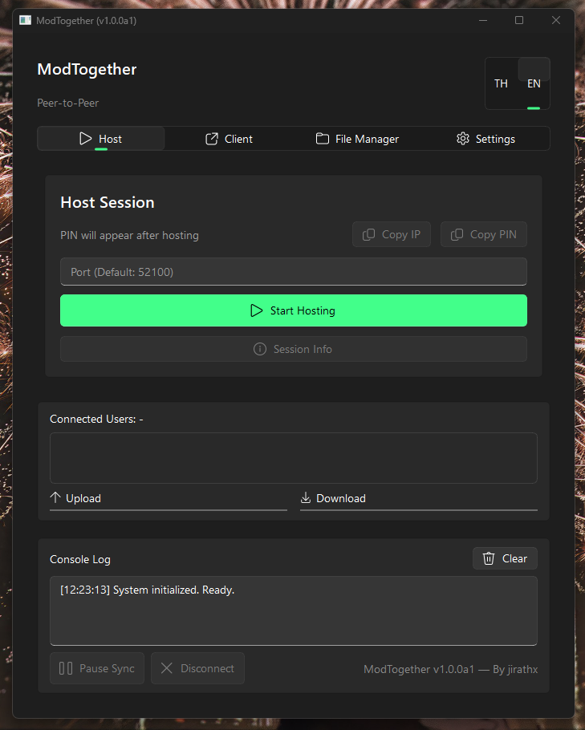

  <h1>ModTogether Universal 🎮</h1>
  
<strong>A fast, modular, and native Peer-to-Peer (P2P) mod synchronization & management tool for PC games.</strong>

  
โปรแกรมสำหรับการซิงค์และจัดการไฟล์ม็อด (Mod) ระหว่างเพื่อนแบบ P2P ที่รวดเร็ว ปลอดภัย และยืดหยุ่นด้วยระบบปลั๊กอิน (C# .NET 8 WPF)

   
  <a href="#-english-version">🇺🇸 English Version</a> &nbsp;|&nbsp; <a href="#-ภาษาไทย-thai-version">🇹🇭 ภาษาไทย (Thai Version)</a>
    
  

---

## 🇺🇸 English Version

> [!WARNING]
> ## Disclaimer
> This application is **NOT** a cheat, hack, or memory injection tool. It is strictly a "File Synchronization & Mod Management Tool" designed to copy mod files over a network between peers. Its sole purpose is to facilitate Co-op gaming by ensuring all players have identical mod files. It does not interact with game memory or bypass Anti-Cheat systems. The mechanism is functionally identical to sending files via Google Drive or Zip archives over chat, but fully automated and direct.

### 📦 Modular Architecture & Game Extensions

ModTogether is designed as a **Universal P2P Mod Management Suite** powered by an extensible plugin architecture:
- 🧩 **Core App (`ModTogetherUniversal`)**: C# .NET 8 WPF application providing the high-speed P2P engine, Room management, Mod Explorer, and WinUI 3 Fluent interface.
- 🔌 **Extension Engine (`ModTogether.API`)**: Plugin API supporting game extensions written in C#, Lua, or JavaScript.
- 🐉 **Monster Hunter World Extension (`ModTogether.Extensions.MHW`)**: Official extension featuring `nativePC` folder management, P2P sync, archive extraction, and file conflict detection.

### 🌟 Key Features
- ⚡ **Real-Time P2P Sync:** Instant peer-to-peer file synchronization driven by embedded ASP.NET Core Kestrel HTTP streaming.
- 🏠 **Unified Room Control:** Side-by-side Host (Create Session) & Client (Join Session) interface with 6-digit PIN authentication.
- 🎨 **Mod Presets & Profile Stashing:** Save/Load custom Mod Presets (`Documents/ModTogether/presets/`). Swapping presets safely stashes original active mods into `.stash` without data loss.
- ♻️ **Smart Recycle Mods & SHA-256 P2P Optimization:** Tracks mod ownership in `mod_owners.json`. Automatically moves unreferenced mod files into `.recycle_mods` when players leave, and restores matching mods via SHA-256 integrity checks without duplicate downloads.
- 👥 **User Ownership Badges:** Displays visual owner badges (e.g. `👤 Host`, `👥 Shared (Host, Player2)`) across Mod Explorer & Plugin Mod Libraries.
- 🔒 **Session Lock Protection:** Strictly locks preset changing during active room sessions (Host/Client) to prevent major file synchronization conflicts.
- 🧩 **Online Plugin Store & Extensions:** Direct integration with GitHub Releases for real compiled `.dll` plugin extensions with SHA verification.
- 💾 **Session State Persistence:** Remembers last selected presets, ports, and interface states saved in `Documents/ModTogether/sessions/session.json`.
- 📊 **Bandwidth Limiter & Live Progress:** Speed limit controls (Kbps) and real-time speedometers/progress bars.
- 🎮 **Discord Rich Presence (RPC):** Live status updates on Discord showing room code, host status, and active player counts.
- 🔍 **Mod Explorer:** Search and manage mods with explicit `⚡ Install Checked` and row-level `Install` buttons.
- 📦 **Full Archive Support:** Native handling for `.zip`, `.7z` (including Solid LZMA2 archives), and `.rar` files.
- 📁 **Conflict Detection:** Scans mod archives to detect potential file overlaps before installation.
- 🌐 **Bilingual UI (English / Thai):** Instant language switching without restarting the app.

### 🚀 Build Editions
ModTogether provides **2 build editions**:
1. 🟢 **Standalone Edition (`ModTogether_Universal_Standalone_x64.exe` ~85MB)**
   - Includes .NET 8 Runtime bundled inside.
   - **No installation or .NET download required.** Completely portable out of the box.
2. ⚡ **Lightweight Edition (`ModTogether_Universal_Lightweight_x64.exe` ~10MB)**
   - Ultra lightweight (~10MB).
   - Requires [.NET 8 Desktop Runtime](https://dotnet.microsoft.com/download/dotnet/8.0) installed on Windows.

### 🛠️ How to Build
Requires [.NET 8 SDK](https://dotnet.microsoft.com/download/dotnet/8.0) installed.
1. Double-click `build_universal.bat` (or run `.\build_universal.bat` in Terminal).
2. Output executables and extensions will be generated in the `dist` folder:
   - `dist\ModTogether_Universal_Standalone_x64.exe`
   - `dist\ModTogether_Universal_Lightweight_x64.exe`
   - `dist\Extensions\`

### 🛡️ Antivirus & Security Notice
- Built using official Microsoft .NET 8 Single-File bundling with ReadyToRun (R2R) compilation and embedded debug symbols.
- **100% Safe & Open-Source:** No third-party packers (UPX) or obfuscators (ConfuserEx) are used. Certified clean for VirusTotal and Nexus Mods distribution.

### 🎯 How to Use

#### Creating or Joining a Room
1. Open the app and navigate to the **Room** tab.
2. **To Host:** Click **Start Hosting** under *Create Session (Host)*. Share the generated IP and 6-digit PIN with your friends.
3. **To Join:** Enter the Host's IP address and 6-digit PIN under *Join Session (Client)*, or click **Scan LAN** to auto-detect hosts on your local network / VPN (ZeroTier, Radmin, Hamachi). Click **Join**.

#### Managing & Auto-Installing Mods
- Go to the **Mod Manager** tab.
- Click **Import Mod** or drop `.zip`/`.7z`/`.rar` files into the `GameMods` folder.
- Toggle checked mods and click **Install Checked** to extract them straight into your game's mod directory.
- If **Auto Enable Downloaded Mods** is enabled in Settings, newly downloaded P2P mods will automatically install upon arrival!

---

## 🇹🇭 ภาษาไทย (Thai Version)

> [!WARNING]
> ## คำชี้แจงสำคัญ (Disclaimer)
> โปรแกรมนี้ **ไม่ใช่** โปรแกรมช่วยเล่น (Cheat/Hack) หรือโปรแกรมแทรกแซงหน่วยความจำ (Memory Injection) ของตัวเกมแต่อย่างใด เป็นเพียงแค่ "เครื่องมือซิงค์และจัดการไฟล์ม็อด (File Synchronization & Mod Management Tool)" ที่ช่วยคัดลอกไฟล์จากเครื่องหนึ่งไปยังอีกเครื่องหนึ่งผ่านเครือข่าย เพื่อความสะดวกในการเล่นเกม Co-op ที่ต้องใช้ม็อดตรงกันเท่านั้น ไม่มีเจตนาในการละเมิดกฎกติกาหรือข้ามผ่านระบบ Anti-Cheat ของเกม การทำงานเทียบเท่ากับการส่งไฟล์ผ่าน Google Drive หรือบีบอัดไฟล์ Zip ส่งให้เพื่อนทางแชท เพียงแต่เป็นการทำงานให้อัตโนมัติและส่งหากันโดยตรงเท่านั้น

### 📦 สถาปัตยกรรมระบบปลั๊กอิน (Modular Architecture & Game Extensions)

ModTogether ถูกออกแบบเป็น **ชุดโปรแกรมซิงค์ม็อด P2P แบบเอนกประสงค์ (Universal Suite)** ที่ขับเคลื่อนด้วยระบบปลั๊กอินส่วนขยาย:
- 🧩 **แอปพลิเคชันหลัก (`ModTogetherUniversal`)**: โปรแกรม C# .NET 8 WPF ที่ทำหน้าที่รันระบบ P2P, จัดการห้อง, Mod Explorer และหน้าต่าง WinUI 3 Fluent
- 🔌 **ระบบส่วนขยาย (`ModTogether.API`)**: ระบบ API รองรับปลั๊กอินเสริมของแต่ละเกม พัฒนาได้ด้วย C#, Lua หรือ JavaScript
- 🐉 **ส่วนขยาย Monster Hunter World (`ModTogether.Extensions.MHW`)**: ปลั๊กอินอย่างเป็นทางการสำหรับเกม MHW รองรับการจัดการโฟลเดอร์ `nativePC`, ซิงค์ P2P, คลายบีบอัดไฟล์ม็อด และตรวจจับไฟล์ทับซ้อน

### 🌟 จุดเด่นและฟีเจอร์หลัก
- ⚡ **ซิงค์ม็อดเรียลไทม์ (Real-Time P2P Sync):** เมื่อโฮสต์เพิ่มม็อดใหม่ ระบบจะส่งไฟล์ไปให้เครื่องเพื่อนๆ ในห้องทันทีผ่านระบบ Kestrel HTTP Streaming
- 🏠 **หน้าจัดการห้องรวม (Unified Room Page):** รวมหน้าสร้างห้อง (Host) และเข้าร่วมห้อง (Client) ไว้ในหน้าเดียว พร้อมระบบรหัส PIN 6 หลัก
- 📊 **ติดตามความเร็ว & แถบสถานะเรียลไทม์ (Bandwidth Tracker & Live Progress):** วัดความเร็ว Upload/Download และแสดงสถานะการคลายบีบอัดแบบ Real-time
- 🧩 **ระบบจัดการปลั๊กอิน (Plugin & Extension Manager):** โหลดและจัดการส่วนขยายประจำเกมต่างๆ (C#, Lua, JS) ได้อย่างง่ายดาย
- 🔍 **ระบบสำรวจม็อด (Mod Explorer):** ค้นหาและดูรายละเอียดม็อดเชื่อมต่อกับ Nexus Mods ได้โดยตรงในโปรแกรม
- 📦 **รองรับไฟล์บีบอัดทุกประเภท:** คลายบีบอัดไฟล์ `.zip`, `.7z` (รวมถึง Solid LZMA2 Archives) และ `.rar` ได้สมบูรณ์
- 🗑️ **ถังขยะกู้ข้อมูลประหยัดอินเทอร์เน็ต (Smart Recycle Bin):** ไฟล์ที่โดนลบจะย้ายไปเก็บที่ `.recycle_mods` สามารถกู้คืนได้ทันทีโดยไม่ต้องโหลดใหม่
- 📁 **ตรวจสอบไฟล์ทับซ้อน (Conflict Detection):** สแกนไฟล์ม็อดเพื่อแจ้งเตือนความเสี่ยงการเขียนทับไฟล์ก่อนเริ่มติดตั้ง
- 🌐 **รองรับ 2 ภาษา (Bilingual UI):** สลับเปลี่ยนภาษาไทยและอังกฤษในโปรแกรมได้ทันทีโดยไม่ต้องรีสตาร์ท
- 🛡️ **ระบบป้องกันการแครชด้าน Network:** มีระบบจัดการ UDP Socket WSAEACCES และสแกนหาห้องใน LAN/VPN (ZeroTier, Radmin VPN, Hamachi)
- 🎨 **ดีไซน์สวยงามระดับ Windows 11:** พัฒนาด้วย C# .NET 8 WPF และ `WPF-UI` (WinUI 3 Design)

### 🚀 ตัวเลือกเวอร์ชันจัดส่ง (Build Editions)
โปรแกรมมี **2 เวอร์ชัน** ให้เลือกใช้งานตามความเหมาะสม:
1. 🟢 **เวอร์ชัน Standalone (`ModTogether_Universal_Standalone_x64.exe` ~85MB)**
   - มัดรวม .NET 8 Runtime มาในตัวโปรแกรม
   - **ไม่ต้องติดตั้งโปรแกรมหรือลง .NET เพิ่มเติม** ดับเบิลคลิกเปิดใช้งานบน Windows 10/11 ได้ทันที
2. ⚡ **เวอร์ชัน Lightweight (`ModTogether_Universal_Lightweight_x64.exe` ~10MB)**
   - ขนาดไฟล์เบาหวิวเพียง ~10MB
   - จำเป็นต้องมี [.NET 8 Desktop Runtime](https://dotnet.microsoft.com/download/dotnet/8.0) ติดตั้งอยู่ในเครื่องก่อน

### 🛠️ วิธีการ Build โปรแกรม
จำเป็นต้องมี [.NET 8 SDK](https://dotnet.microsoft.com/download/dotnet/8.0) ติดตั้งบนเครื่องนักพัฒนา
1. ดับเบิลคลิกไฟล์ `build_universal.bat` (หรือรัน `.\build_universal.bat` ใน Terminal)
2. สคริปต์จะทำการ Restore Dependencies และ Build ทั้ง 2 เวอร์ชันพร้อม Extensions ออกมาในโฟลเดอร์ `dist`:
   - `dist\ModTogether_Universal_Standalone_x64.exe`
   - `dist\ModTogether_Universal_Lightweight_x64.exe`
   - `dist\Extensions\`

### 🛡️ ความปลอดภัยและการสแกนแอนตี้ไวรัส (Security & Antivirus Notice)
- คอมไพล์ด้วยระบบ Single-File Bundling ทางการของ Microsoft .NET 8 ร่วมกับเทคโนโลยี ReadyToRun (R2R) และฝัง Debug Symbols (PDB) ในตัว
- **ปลอดภัย 100% และเป็น Open-Source:** ไม่มีการใช้เครื่องมือพรางโค้ด (ConfuserEx) หรือเครื่องมือบีบอัดภายนอก (UPX) ที่มักทำให้เกิดผลสแกนไวรัสผิดพลาด ปลอดภัยสำหรับการแจกจ่ายบน VirusTotal และ Nexus Mods

### 🎯 วิธีการใช้งาน

#### การสร้าง หรือ เข้าร่วมห้อง (Room)
1. เปิดโปรแกรม เข้าไปที่แท็บ **สร้าง / เข้าร่วมห้อง (Room)**
2. **สำหรับคนเปิดห้อง (Host):** กดปุ่ม **เริ่มเปิดห้อง** ในฝั่ง *สร้างห้อง (Host)* จากนั้นนำ IP และ PIN 6 หลักไปแจ้งเพื่อน
3. **สำหรับคนเข้าร่วม (Client):** กรอก IP และ PIN 6 หลัก ในฝั่ง *เข้าร่วมห้อง (Client)* หรือกดปุ่ม **ค้นหาใน LAN** เพื่อสแกนหาห้องอัตโนมัติ (รองรับ ZeroTier, Radmin VPN, Hamachi) แล้วกด **เข้าร่วม**

#### การจัดการและติดตั้งม็อด (Mod Manager)
- เข้าไปที่แท็บ **จัดการม็อด (Mod Manager)**
- กดปุ่ม **นำเข้าม็อด** หรือลากไฟล์ `.zip`/`.7z`/`.rar` มาวางในโฟลเดอร์ `GameMods`
- ติ๊กเลือกลิสต์ม็อดที่ต้องการ แล้วกดปุ่ม **ติดตั้งที่เลือก** เพื่อคลายบีบอัดลงโฟลเดอร์ม็อดของเกมทันที
- หากเปิดตัวเลือก **เปิดใช้งาน Mod ที่โหลดมาอัตโนมัติ** ในหน้าตั้งค่า เมื่อดาวน์โหลดม็อดจากเพื่อนเสร็จ ระบบจะติดตั้งให้อัตโนมัติทันที!

---

## 🙏 Acknowledgements & Tech Stack

- **[.NET 8 (WPF)](https://dotnet.microsoft.com/):** High-performance desktop UI and CoreCLR runtime.
- **[WPF-UI (v3.0.4)](https://github.com/lepoco/wpfui):** Modern WinUI 3 controls and Fluent design elements.
- **[ASP.NET Core Kestrel](https://learn.microsoft.com/en-us/aspnet/core/fundamentals/servers/kestrel):** High-speed embedded HTTP web server powering P2P transfers.
- **[SharpCompress (v0.38.0)](https://github.com/adamhathcock/sharpcompress):** Robust archive extraction library for Zip, 7z, and Rar formats.
- **[ModTogether.API]:** Extensible plugin API for Lua, JavaScript, and C# game extensions.
